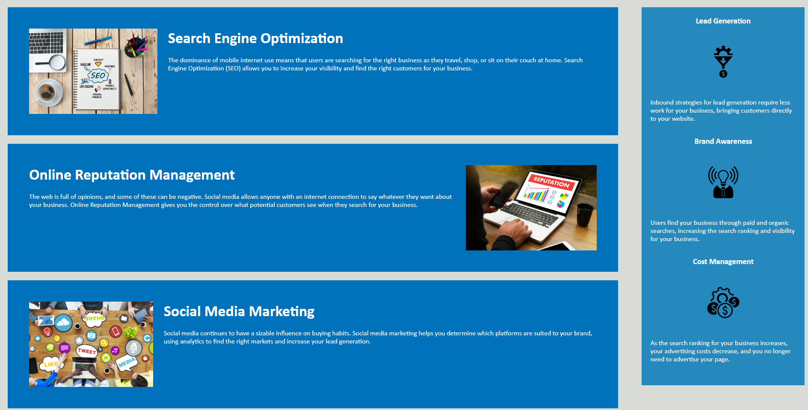

# Horiseon - Your Accessible Online Marketing Agency

## Description 

This project was built to refactor a codebase in order to improve its accessibility. We want to make sure that every user is able to access the website, inclusing those using assisstive technologies.  

Improvements added to the source code vary from: including semantic HTML elements to clearly define the content within, adding accessible alt attributes to images and making sure that HTML elements follow a logical structure.    

A link to the deployed application can be found here.

## Usage 

---

© 2023 edX Boot Camps LLC. Confidential and Proprietary. All Rights Reserved.
